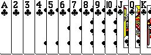



## Playing\-Card Deck OCX

### Description

This OCX is used to draw playing cards wherever in your game. all 52 cards, Plus 2 jokers. It uses the bitblt to draw a card (using a card number (1-52 or 53&54 for jokers)) on a specifyed DC. Real easy. You can make games if you draw cards into different picture controls (so you can have event handeling like clicking or dragging) It also has built in functions to get the suit of a card number, or get the 'value' of a card (scale of 1-13 ace 1, king 13). If you like this, Please vote for me ;)
 
### More Info
 

             |
---                |---
**Submitted On**   |2002-02-01 14:44:08
**By**             |[Matt Carpenter](https://github.com/Planet-Source-Code/PSCIndex/blob/master/ByAuthor/matt-carpenter.md)
**Level**          |Intermediate
**User Rating**    |5.0 (15 globes from 3 users)
**Compatibility**  |VB 6\.0, VB Script
**Category**       |[Graphics](https://github.com/Planet-Source-Code/PSCIndex/blob/master/ByCategory/graphics__1-46.md)
**World**          |[Visual Basic](https://github.com/Planet-Source-Code/PSCIndex/blob/master/ByWorld/visual-basic.md)
**Archive File**   |[Playing\-Ca52312212002\.zip](https://github.com/Planet-Source-Code/matt-carpenter-playing-card-deck-ocx__1-31396/archive/master.zip)

